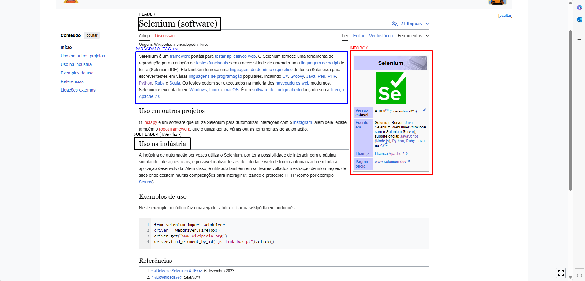
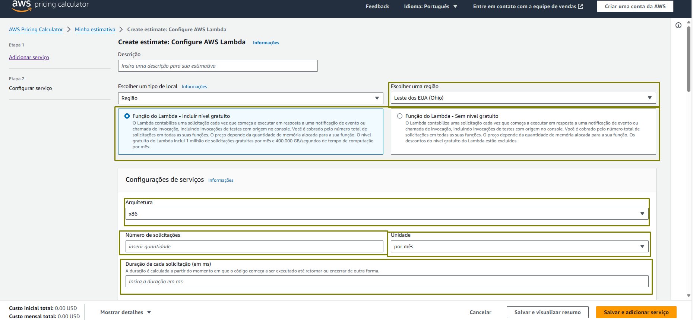
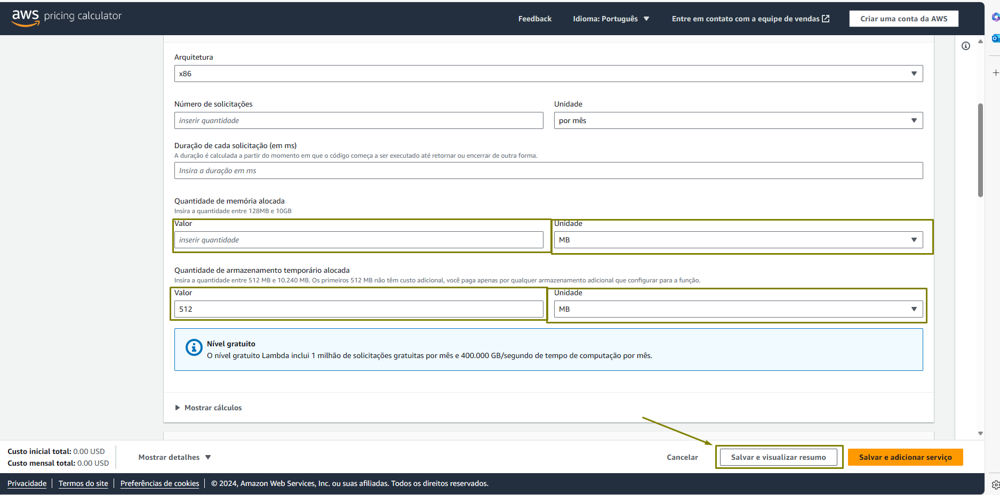
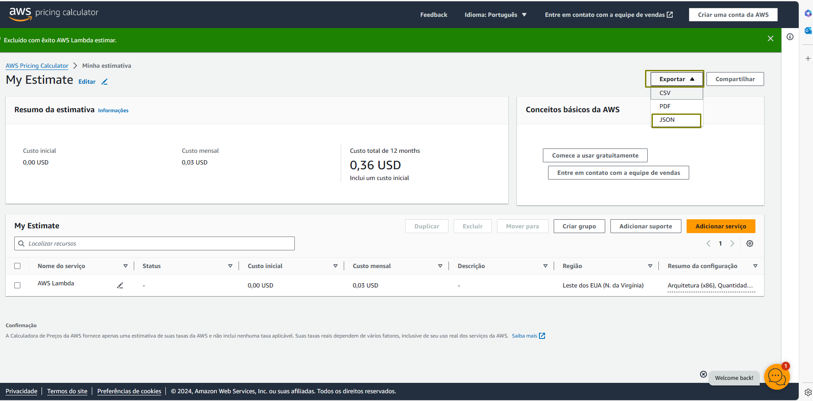

# Testes Técnicos RPA Python - Desenvolvedor RPA Pleno na Kor Solutions
Olá e seja bem-vindo aos testes técnicos para a vaga de desenvolvedor RPA Pleno na Kor Solutions!

Nestes desafios, você terá a oportunidade de demonstrar suas habilidades de automações de Web Scraping e automações focadas em input de dados em aplicações web.

É obrigatório a resolução dos 2 desafios.

## Desafio - Web Scrape
Nesse desafio você deve desenvolver uma solução RPA que colete dados de uma página da Wikipédia. O objetivo é extrair o dados do infobox, dos parágrafos, organizados dentro dos títulos além dos hyperlinks encontrados.

O output deve ser um arquivo .json seguindo os moldes disponíveis no 'Output Raw', analise o 'Modelo de Output' para um exemplo com dados coletados.

Sua solução deve trabalhar com o modelo de input disponível abaixo, NÃO modifique o modelo de input.

Foque em executar sua solução em cima dos casos de teste disponibilizados no link abaixo.

##### Exemplo dos elementos a coletar

##### Modelos
[Modelo de Input - Web Scrape](examples/web_scrape/web_scrape_input.json)

[Modelo de Output - Web Scrape](examples/web_scrape/web_scrape_output.json)

[Output Raw - Web Scrape](examples/web_scrape/web_scrape_output_raw.json)

##### Casos de teste
[Casos de Teste - Web Scrape](test_cases/web_scrape_test_cases.json)

## Desafio - Cost Calculator
Nesse desafio você deve desenvolver uma solução RPA que deve preencher um formulário do AWS Cost Calculator para os parâmetros básicos de um recurso Lambda e no final gerar um arquivo a partir dos dados de input passados.

O output sera o aquivo .json exportado pela aplicação da AWS no último passo citado acima.

Sua solução deve trabalhar com o modelo de input disponível abaixo, NÃO modifique o modelo de input.

Foque em executar sua solução em cima dos casos de teste disponibilizados no link abaixo.

###### Passo a Passo

- selecionar em **"Escolher uma região"** a partir do valor do input **"region"**
- selecionar se o calculo é com ou sem nível gratuito a partir do valor do input **"calculate_with_free_tier"**
- selecionar em **"Arquitetura"** a partir do valor do input **"architecture"**
- selecionar em **"Número de solicitações"** a partir do valor do input **"number_of_requests.quantity"**
- selecionar em **"Unidade"** a partir do valor do input **"number_of_requests.unit"**
- selecionar em **"Duração de cada solicitação (em ms)"** a partir do valor do input **"duration"**

- selecionar em **"Valor"**, dentro de **"Quantidade de memória alocada"** a partir do valor do input **"memory"**
- selecionar em **"Unidade"**, dentro de **"Quantidade de memória alocada"** o valor padrão de **"MB"**
- selecionar em **"Valor"**, dentro de **"Quantidade de armazenamento temporário alocada"** a partir do valor do input "ephemeral_storage"
- selecionar em **"Unidade"**, dentro de **"Quantidade de armazenamento temporário alocada"** o valor padrão de **"MB"**

- selecionar em **"Exportar"** a opção **"JSON"** e então salvar localmente o resultado.

##### Modelos
[Modelo de Input - Cost Calculator](examples/cost_calculator/cost_calculator_input.json)

[Modelo de Output - Cost Calculator](examples/cost_calculator/cost_calculator_output.json)

##### Casos de teste
[Casos de Teste - Cost Calculator](test_cases/cost_calculator_test_cases.json)

##### Outros link
[AWS Cost Calculator](https://calculator.aws/#/createCalculator/Lambda)

##### Observações
Evite utilizar uma solução via requests para esse desafio.

## Envio do Projeto

Após finalizar a implementação, envie o link do seu repositório no GitHub para o e-mail lucas.maion@kor.solutions, juntamente com seu nome completo.

## Dúvidas

Em caso de dúvidas durante o teste, por favor, abra uma nova [issue](https://github.com/kor-solutions/dev-test-rpa-pl/issues/new/choose) neste repositório para que possamos ajudá-lo.

Boa sorte! Estamos ansiosos para ver sua implementação :smiley:.